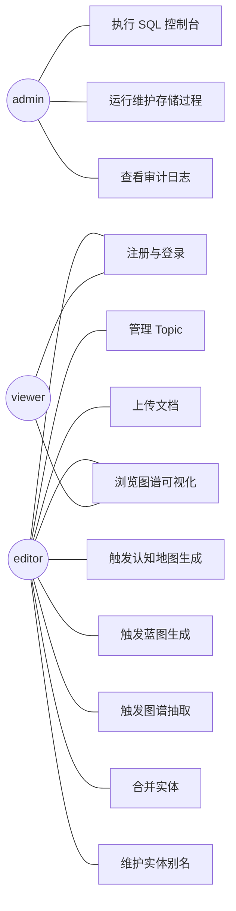

# 需求分析文档

## 1. 项目背景与价值

在数字化办公、研究和学习场景中,知识普遍以非结构化文本的形式散落于各类文档之中,例如项目复盘、读书笔记、案例研究、传记和会议纪要等。每一份文档单独存在,即使主题相同,信息之间也彼此孤立,难以建立跨文档的语义联系。研究者、知识工作者在面对几十甚至上百份文档时,往往需要反复翻阅、手工归纳,效率低下,知识难以复用。

针对上述痛点,本项目设计并实现了**叙事型知识图谱管理系统(Narrative Knowledge Graph,简称 NKG)**。系统通过用户上传文档、按主题(Topic)组织文档集合的方式,自动调用大语言模型完成"单文档认知地图 → 主题级分析蓝图 → 全局知识图谱"三段式知识抽取流程,将散落的文本信息转化为以实体节点和关系边为核心的结构化图谱。在此基础上,用户可以通过图谱可视化界面浏览实体网络,可以执行实体合并、别名管理、跨文档查询等操作,从而真正把分散在文档中的知识沉淀下来,形成可被持续维护、复用、扩展的资产。

从数据库课程的角度看,本系统不仅解决了一个真实的知识管理问题,而且围绕 MySQL 8 严格落地了课程要求的关系模式设计、规范化、触发器、存储过程、游标、二级索引、性能分析等所有评分硬指标,具备工程价值与教学示范价值。

## 2. 干系人与角色

系统通过 RBAC(Role-Based Access Control)模型管理角色权限。共划分为三种角色,职责互不重叠,任何用户在注册时归入 editor 角色,管理员可在用户设置页面调整。

| 角色 | 主要职责 |
|---|---|
| admin | 拥有全部权限。除内容管理外,可访问 SQL 控制台、用户管理、维护工具(重算实体提及次数、归档过期主题、批量改名)以及全部审计日志。 |
| editor | 系统的主要使用者。可创建和管理自己拥有的 Topic、上传文档、触发抽取、合并实体、维护别名、浏览图谱,但不能访问 SQL 控制台和系统级维护接口。 |
| viewer | 只读角色。可浏览所有公开 Topic 的图谱、实体、关系和文档内容,但不能进行任何写操作。 |

## 3. 用例分析

下面给出系统的整体用例图,涵盖三个角色与十个核心用例。

核心用例描述如下。

- **UC1 注册与登录**:用户提交用户名、邮箱、密码完成注册,密码使用 bcrypt 哈希存入 users 表;登录成功后服务端签发 JWT,前端在后续请求的 Authorization 请求头中携带令牌。
- **UC2 管理 Topic**:editor 创建主题,设置名称、描述、是否归档;同一所有者下主题名称不可重复(由 UNIQUE 约束保证)。
- **UC3 上传文档**:editor 在选定 Topic 下上传文本、Markdown 或 PDF 文件,后端计算 SHA-256 内容哈希用于去重,触发器自动维护主题文档计数并创建抽取任务。
- **UC4 触发认知地图生成**:针对单个文档调用 LLM 生成认知地图,产出关键实体、主题、时间线、结构模式等 JSON 字段,写入 cognitive_maps 表。
- **UC5 触发蓝图生成**:针对一个 Topic 聚合所有文档的认知地图生成跨文档分析蓝图,确定权威实体名、关键模式、全局时间线,写入 analysis_blueprints 表。
- **UC6 触发图谱抽取**:基于蓝图与各文档块,LLM 抽取实体与关系并落库;BEFORE INSERT 触发器拒绝跨主题关系。
- **UC7 浏览图谱**:前端使用 ECharts 力导向图展示实体节点与关系边,节点颜色区分类型,大小映射度中心性;支持搜索、过滤和详情面板。
- **UC8 合并实体**:editor 选择两个实体执行合并,后端调用 sp_merge_entities 在事务内完成关系、映射、别名迁移与审计写入,任意失败整体回滚。
- **UC9 维护实体别名**:用户为实体新增、删除别名,系统在合并和重命名时也会自动建立别名记录。
- **UC10 执行 SQL 控制台**:admin 在前端 Monaco 编辑器中执行任意单条 SQL,后端按语句类型路由到 SELECT、EXPLAIN、DDL、CALL 等不同处理器,所有执行写入审计日志。
- **UC11 运行维护存储过程**:admin 在维护页面调用 sp_recompute_entity_mentions、sp_archive_inactive_topics、sp_propagate_entity_rename 等游标存储过程完成系统级数据维护。
- **UC12 查看审计日志**:admin 浏览全量操作日志,editor 浏览自己相关的操作日志,日志记录 user_id、action、entity_type、entity_id、before_value、after_value、ip_address、created_at 等字段。

## 4. 功能性需求

下面列出十二项核心功能需求,作为开发与验收的依据。

- **F1 用户与角色管理**:支持注册、登录、JWT 鉴权、角色切换、密码重置;admin 可管理全部用户。
- **F2 Topic 管理**:支持 Topic 的增删改查、归档、所有者隔离;唯一约束防止同一所有者下重名;Topic 删除级联删除其下文档与图谱数据。
- **F3 文档管理**:支持文本、Markdown、PDF 三类文档上传与解析;计算 SHA-256 哈希用于去重;按状态机标记 uploaded → chunking → chunk_done → extracting → completed → failed。
- **F4 文档切块**:依据段落与最大 token 数对文档进行切块写入 document_chunks 表;唯一索引保证 (document_id, chunk_index) 不重复。
- **F5 LLM 调用与 mock**:封装 MiniMax OpenAI 兼容接口;在缺少 API key 时自动回退到本地规则 mock,保证演示环境可用。
- **F6 认知地图生成**:对单文档生成关键实体、主题、时间线、结构模式 JSON,写入 cognitive_maps;同一文档存在 UNIQUE 约束。
- **F7 分析蓝图生成**:基于 Topic 内全部认知地图生成 canonical_entities、key_patterns、global_timeline 蓝图,并维护蓝图状态字段。
- **F8 实体与关系抽取**:基于蓝图与文档块抽取实体、关系、块-实体映射;触发器维护反规范化字段并拒绝跨主题关系。
- **F9 实体合并与别名**:在事务内迁移别名、关系、映射并删除被合并实体;别名表使用 (entity_id, alias) 唯一约束。
- **F10 图谱可视化**:前端使用 ECharts force-directed 布局展示节点与边;支持深度查询、搜索过滤、节点详情。
- **F11 SQL 控制台**:admin 可执行 SELECT、EXPLAIN、DDL、CALL、SHOW 等任意单条 SQL,结果按类型可视化,支持事务模式、超时控制、单语句限制。
- **F12 审计与维护**:所有写操作写入 audit_logs;admin 可调用维护型游标存储过程,完成提及次数重算、过期主题归档、批量改名。

## 5. 非功能性需求

性能方面,要求单条索引命中查询响应时间不超过 50 毫秒,十万行规模下 EXPLAIN ANALYZE 实测应该走索引而非全表扫描。可用性方面,前端 13 个页面在网络正常时秒级响应,关键操作均提供 loading、错误提示、二次确认。安全方面,密码使用 bcrypt 加盐哈希,接口鉴权使用 JWT,SQL 控制台仅 admin 可访问、单语句限制、设置 max_statement_time 防死循环。可扩展性方面,数据库层预留 chunk_embeddings 与 entity_embeddings 两张 RAG 表以及五个 stub 路由,通过 RAG_ENABLED 开关控制启用,未来切换到 MySQL 9 或 Milvus 时仅需修改向量列定义。

## 6. 数据需求与约束

系统共设计十二张主表和两张 RAG 预留表。每张主表均使用 BIGINT 自增主键、utf8mb4 字符集、InnoDB 引擎,DATETIME 字段统一使用 CURRENT_TIMESTAMP 默认值并在更新时自动刷新。业务约束方面,users 表对 username 与 email 各加 UNIQUE;topics 表对 (owner_id, name) 加 UNIQUE 防止同一用户下重名;documents 表对 content_hash 加普通索引以支持去重;cognitive_maps 表 document_id 唯一,实现一对一关系;analysis_blueprints 表 topic_id 唯一;entities 表对 (topic_id, entity_type, canonical_name) 加 UNIQUE;entity_aliases 表对 (entity_id, alias) 加 UNIQUE;relationships 表对 (topic_id, source_entity_id, target_entity_id, relation_type) 加 UNIQUE,并通过 CHECK 约束禁止自环;chunk_entity_mapping 表对 (chunk_id, entity_id) 加 UNIQUE。所有外键均明确定义级联策略:Topic 删除时级联其下数据,User 删除则置空相关记录,从而既保证引用完整性又允许必要的清理。

## 7. 风险与限制

第一,实验室既有 TiDB 集群不支持触发器、存储过程、游标和 UDF,因此本作业必须独立部署在本地 MySQL 8 之上,无法直接复用既有 TiDB 表结构。第二,LLM 调用依赖 MiniMax 公网服务,存在网络抖动、配额限速、密钥失效等风险,因此后端 llm.py 提供完整的 mock 实现,无需 API 也可进行三段式抽取的演示。第三,SQL 控制台允许执行任意 DDL/DML,如果未加防护可能导致误删数据,因此控制台仅对 admin 开放、单条限制、写审计、设置 max_statement_time 上限,并提供 SQL_CONSOLE_ENABLED 全局开关一键关闭。第四,部分二级索引被外键隐式依赖,无法 DROP 后做"对照实验",这一现象在性能分析文档中专门讨论。第五,本作业明确不实现多租户、OAuth、移动端、模型微调等高级特性,以保证课程评分相关核心功能的质量与稳定。
