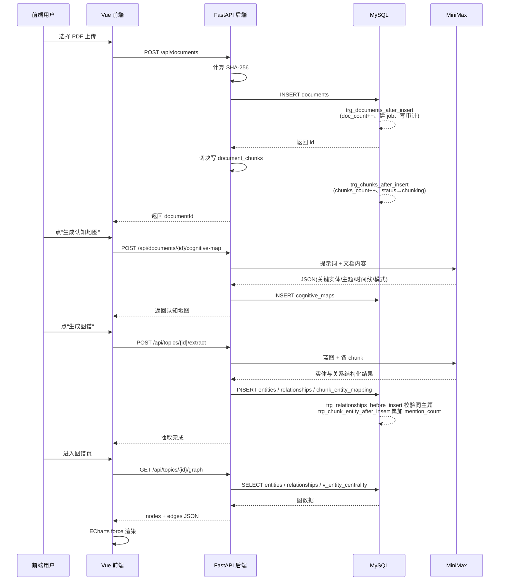

# 系统设计文档

## 1. 系统架构

NKG 系统采用前后端分离的三层架构,数据库与外部 LLM 通过后端服务进行交互。整体结构如下。


前端负责页面渲染、表单校验、状态管理、可视化呈现;后端负责鉴权、业务流程编排、调用存储过程、与 LLM 交互;数据库承担所有结构化数据的持久化、约束维护、触发器副作用、复杂业务逻辑(以存储过程形式封装);LLM 仅承担文本到结构化数据的转换,通过本地 mock 提供降级能力。这样的分层既符合典型的 Web 应用架构,也使得课程考核的"数据库层重头戏"集中体现在 MySQL 内部。

## 2. 模块划分与接口

后端目录 `backend/app/` 按职责拆分为以下模块:

- `main.py` 启动入口,装配 FastAPI 应用,注册路由,根据 `RAG_ENABLED` 决定是否挂载 RAG 路由。
- `config.py` 读取 `.env`,封装 DB、JWT、LLM、SQL 控制台等配置。
- `db.py` 基于 SQLAlchemy Core + pymysql 创建连接池,提供 `engine.begin()`、`engine.connect()` 入口,所有 SQL 都通过 `text()` 执行,便于阅读原文。
- `security.py` 封装 bcrypt 密码哈希与 python-jose JWT 编解码。
- `deps.py` 提供 `get_current_user`、`require_admin`、`require_editor` 依赖。
- `llm.py` 封装 MiniMax 客户端,根据环境变量自动启用 mock 模式。
- `schemas/` 存放 Pydantic 请求与响应模型。
- `services/` 业务层,典型如 `chunker.py` 进行文档切分、`cognitive.py` 调用 LLM 生成认知地图、`extract.py` 完成实体关系抽取、`sql_console.py` 解析与执行 SQL。
- `routers/` 路由层,共 13 个路由文件覆盖 26 个 API,文件名与功能模块严格一致(auth、topics、documents、cognitive、blueprint、entities、relationships、graph、jobs、audit、admin、dev、rag、extract)。

前端目录 `frontend/src/` 包含 13 个视图(Login、Dashboard、Topics、TopicDetail、Documents、DocumentDetail、Entities、Relationships、Graph、Jobs、Audit、SqlConsole、Settings)与若干公共组件,通过 axios 客户端与后端交互,统一处理鉴权、错误提示与 loading 状态。

## 3. ER 模型

下图给出 14 张表(12 张主表 + 2 张 RAG 预留表)的实体关系。

```mermaid
erDiagram
    users ||--o{ topics : owns
    users ||--o{ documents : uploads
    users ||--o{ extraction_jobs : creates
    users ||--o{ audit_logs : performs
    topics ||--o{ documents : contains
    topics ||--o{ entities : groups
    topics ||--o{ relationships : groups
    topics ||--o{ extraction_jobs : scopes
    topics ||--|| analysis_blueprints : has
    documents ||--o{ document_chunks : split
    documents ||--|| cognitive_maps : has
    documents ||--o{ extraction_jobs : runs
    document_chunks ||--o{ chunk_entity_mapping : mentions
    document_chunks ||--|| chunk_embeddings : embeds
    entities ||--o{ entity_aliases : aliased
    entities ||--o{ chunk_entity_mapping : mentioned
    entities ||--o{ relationships : src
    entities ||--o{ relationships : dst
    entities ||--|| entity_embeddings : embeds

    users {
        BIGINT id PK
        VARCHAR username UK
        CHAR password_hash
        VARCHAR email UK
        ENUM role
    }
    topics {
        BIGINT id PK
        VARCHAR name
        BIGINT owner_id FK
        INT doc_count
        ENUM blueprint_status
    }
    documents {
        BIGINT id PK
        BIGINT topic_id FK
        BIGINT uploader_id FK
        CHAR content_hash
        ENUM status
    }
    document_chunks {
        BIGINT id PK
        BIGINT document_id FK
        INT chunk_index
        MEDIUMTEXT content
    }
    cognitive_maps {
        BIGINT id PK
        BIGINT document_id FK_UK
        JSON key_entities
        JSON themes
    }
    analysis_blueprints {
        BIGINT id PK
        BIGINT topic_id FK_UK
        JSON canonical_entities
    }
    entities {
        BIGINT id PK
        BIGINT topic_id FK
        VARCHAR canonical_name
        ENUM entity_type
        INT mention_count
    }
    entity_aliases {
        BIGINT id PK
        BIGINT entity_id FK
        VARCHAR alias
    }
    relationships {
        BIGINT id PK
        BIGINT topic_id FK
        BIGINT source_entity_id FK
        BIGINT target_entity_id FK
        VARCHAR relation_type
    }
    chunk_entity_mapping {
        BIGINT id PK
        BIGINT chunk_id FK
        BIGINT entity_id FK
        INT occurrences
    }
    extraction_jobs {
        BIGINT id PK
        BIGINT document_id FK
        BIGINT topic_id FK
        ENUM job_type
        ENUM status
    }
    audit_logs {
        BIGINT id PK
        BIGINT user_id FK
        VARCHAR action
    }
    chunk_embeddings {
        BIGINT chunk_id PK_FK
        LONGBLOB embedding
    }
    entity_embeddings {
        BIGINT entity_id PK_FK
        LONGBLOB embedding
    }
```

整个 ER 图最深参照链是 `documents → document_chunks → chunk_entity_mapping → entities ← relationships`,深度达四级,远超课程要求的"≥5 张表 + 参照关系"。

## 4. 关系模式

按表给出关系模式,主键加下划线表示,外键以注释标记。

```
users(id, username, password_hash, email, role, created_at, updated_at)
topics(id, name, description, owner_id→users, doc_count, blueprint_status,
       is_archived, created_at, updated_at)
documents(id, topic_id→topics, uploader_id→users, title, source_type,
          original_filename, file_size, storage_path, content, content_hash,
          chunks_count, status, uploaded_at, updated_at)
document_chunks(id, document_id→documents, chunk_index, content,
                content_hash, token_count, created_at)
cognitive_maps(id, document_id→documents UK, summary, key_entities,
               themes, timeline, structural_patterns, generated_by,
               version, generated_at, updated_at)
analysis_blueprints(id, topic_id→topics UK, canonical_entities, key_patterns,
                    global_timeline, processing_instructions,
                    contributing_doc_count, source_data_hash, status,
                    version, generated_at, updated_at)
entities(id, topic_id→topics, canonical_name, entity_type, description,
         attributes, mention_count, created_at, updated_at)
entity_aliases(id, entity_id→entities, alias, source, confidence, created_at)
relationships(id, topic_id→topics, source_entity_id→entities,
              target_entity_id→entities, relation_type, description, weight,
              attributes, created_at, updated_at)
chunk_entity_mapping(id, chunk_id→document_chunks, entity_id→entities,
                     occurrences, position_info, created_at)
extraction_jobs(id, document_id→documents, topic_id→topics, job_type,
                status, progress, result, error_message,
                created_by→users, started_at, completed_at,
                created_at, updated_at)
audit_logs(id, user_id→users, action, entity_type, entity_id,
           before_value, after_value, ip_address, created_at)
chunk_embeddings(chunk_id→document_chunks, embedding, embedding_dim,
                 model, norm, created_at)
entity_embeddings(entity_id→entities, embedding, embedding_dim,
                  model, norm, created_at)
```

每张表都以代理键 id 作主键,配以业务唯一约束保证语义不重复。

## 5. 规范化推导

下面按 1NF → 2NF → 3NF 顺序对设计进行论证。

### 5.1 1NF 论证

第一范式要求所有属性原子、不可再分。如果将实体属性表设计为 `entities(id, name, attributes_str)`,其中 `attributes_str` 形如 `"role=manager;city=Beijing;tag=core"`,显然违反了 1NF —— 单一字段存储多个语义独立的键值对。修复方案是采用 JSON 字段存储扩展属性。MySQL 8 的 JSON 类型在存储时是结构化的二进制 BSON-like 表示,支持索引、路径表达式与函数,业界公认这种用法不破坏 1NF —— JSON 字段的"原子单元"是整个文档而非里面的键。本系统在 entities.attributes、relationships.attributes、cognitive_maps.* 等位置都使用了 JSON,既保留了灵活性,又通过严格的 schema 约束保证了原子性。

### 5.2 2NF 论证

第二范式要求非主属性完全依赖于候选键,而非候选键的真子集。设想一个朴素的 `documents_chunks_flat` 大表,主键为 (document_id, chunk_index),包含 doc_title、doc_topic_id、chunk_content 等字段;显然 doc_title、doc_topic_id 仅依赖 document_id,即依赖主键的真子集,产生了部分依赖,违反 2NF。修复方案是把 chunk 内容拆出来,单独成一张 `document_chunks(id, document_id, chunk_index, content, ...)`,而 doc_title、doc_topic_id 留在 documents 中,通过外键关联。这正是本设计采用的方案。

### 5.3 3NF 论证

第三范式要求消除非主属性对主键的传递依赖。设想 entities 大表 `entities(id, ..., alias1, alias2, alias3)`,这种结构既违反 1NF(列重复表达同一语义),也违反 3NF(若假设 alias_set 是一个隐含的虚属性,则存在 entity_id → alias_set → 各别名的传递依赖)。本系统将别名拆出独立的 `entity_aliases(id, entity_id, alias, source, confidence)`,通过 (entity_id, alias) 唯一约束保证组合唯一,完全消除了传递依赖。同理,块到实体的多对多关系也被拆出 `chunk_entity_mapping`,避免了在任一实体表或块表中冗余存储另一方的列表。

### 5.4 反规范化字段的合理性

为了读性能,本设计**有意保留了三个反规范化字段**:`topics.doc_count`、`documents.chunks_count`、`entities.mention_count`。如果严格遵循 3NF,这三个数值都应该通过实时聚合得到,例如 `SELECT COUNT(*) FROM documents WHERE topic_id = ?`。但 Topic 列表页、Dashboard、实体列表都需要展示这些计数,实时聚合在数据规模上升时会造成显著开销。我们的妥协方案是:用触发器实时维护这三个字段(insert/update 时同步增减),并提供 `sp_recompute_entity_mentions` 等修复型存储过程作为兜底。这种"明确标注的反规范化"是工程实践中的常见模式,既不破坏关系完整性,又显著提升读性能,并且通过触发器保证一致性。

## 6. 表结构详细定义

完整 DDL 见 `sql/01_schema.sql`,这里摘取若干关键设计点并阐述设计理由。

`users.password_hash` 使用 CHAR(60) 精确匹配 bcrypt 输出长度,选择 CHAR 而非 VARCHAR 是因为长度固定,可节省 1 字节长度前缀并便于 InnoDB 行内对齐。`users.role` 使用 ENUM 枚举三种角色,在存储上仅占 1 字节,且在 SQL 层即可校验非法取值,优于 VARCHAR + 应用层校验的组合。`topics.uq_topic_owner_name` 防止同一所有者下重名,这一约束的合理性在于"重名 Topic 在 UI 上无法区分,语义模糊"。

`documents.content_hash` 使用 CHAR(64) 存储 SHA-256 十六进制摘要,配合 idx_documents_content_hash 实现 O(log N) 的去重查询;选择哈希而非比较 content 全文是为了避免 MEDIUMTEXT 的逐字节比较开销。`documents.status` 是状态机字段,六个合法状态分别对应上传、切块中、切块完成、抽取中、完成、失败,任何越界更新都会被 ENUM 拒绝。

`document_chunks.content` 使用 MEDIUMTEXT(16 MB)以容纳超长段落;chunk_index 与 document_id 组合唯一,既保证顺序又防止并发插入产生重复块。`cognitive_maps.document_id` 唯一约束实现一对一映射;若需要重生成则 UPSERT 覆盖旧版本,version 字段记录迭代次数。

`entities.entity_type` 用 ENUM 而非 VARCHAR,既限制取值又让 GROUP BY 类型分布的查询能利用枚举的整数表示;复合唯一约束 (topic_id, entity_type, canonical_name) 保证同 topic 下"同名同类型"的实体唯一,且这个唯一索引同时充当查询时的复合索引。

`relationships` 表的 CHECK 约束 `source_entity_id <> target_entity_id` 在数据库层禁止自环,任何应用层 BUG 都无法绕过;weight 字段使用 DECIMAL(4,3) 避免浮点误差。`extraction_jobs.status` 使用 ENUM 表达状态机的合法集合,杜绝出现非法状态;result 使用 JSON 存储任意输出结构。`audit_logs.before_value` 与 `after_value` 使用 JSON 存储任意结构的快照,方便审计回溯,即使 schema 后续演化也不会丢失历史信息。

## 7. 触发器设计

系统设计了 5 个触发器,完全覆盖核心写操作场景。

- `trg_documents_after_insert` 在 documents 插入后自动维护 topics.doc_count、创建一条 cognitive_map 类型的 extraction_job,并写入审计日志。这一设计使得"上传即触发抽取"成为数据库层的硬性保证,前端遗忘也不影响。
- `trg_chunks_after_insert` 在 document_chunks 插入后维护 documents.chunks_count,并将 documents.status 从 uploaded 推进到 chunking,实现状态机的自动流转。
- `trg_relationships_before_insert` 在 relationships 插入前进行业务校验:查询源实体与目标实体的 topic_id,若不一致或与关系本身的 topic_id 不一致则 SIGNAL SQLSTATE '45000' 抛出错误;同时为缺失的 weight 设置默认值 1.000。这是关键的"跨主题关系拒绝"保护。
- `trg_entities_after_update` 在实体被 UPDATE 后比较 OLD/NEW 的 canonical_name,若发生变更则将所属 topic 的 blueprint_status 改为 outdated,并写审计;实现"实体改名→蓝图过期"的级联效应。
- `trg_chunk_entity_after_insert` 在 chunk_entity_mapping 插入后将 entities.mention_count 累加 occurrences,实现反规范化字段的实时维护。

## 8. 存储过程设计

系统共设计 6 个存储过程,3 个使用 IN/OUT 参数,3 个使用游标。

- `sp_create_extraction_job(IN p_doc_id, IN p_job_type, IN p_user_id, OUT p_job_id)` 在事务内校验文档存在性,查询是否已存在同类型 pending/running 任务,若存在直接返回原任务 id 实现幂等,否则插入新记录并写审计。
- `sp_merge_entities(IN p_keep_id, IN p_merge_id, IN p_user_id)` 是最复杂的过程,使用 `FOR UPDATE` 锁定两实体,校验同主题,迁移别名(INSERT IGNORE)、迁移块映射(UPDATE IGNORE 后清理残留)、迁移关系(分别处理 src/dst,避免自环和重复)、删除被合并实体、标记蓝图过期、写审计;任意失败 EXIT HANDLER ROLLBACK。
- `sp_get_entity_neighborhood(IN p_entity_id, IN p_depth, OUT p_node_count)` 在过程内创建三张临时表(tmp_neighborhood、tmp_frontier、tmp_new_nodes),使用 BFS 计算 N 度邻居(限制 depth ≤ 5),最后 SELECT 邻居明细并通过 OUT 参数返回总数。
- `sp_recompute_entity_mentions()` 使用游标遍历 entities,逐个 SUM(occurrences) 重算 mention_count,作为反规范化字段的修复工具。
- `sp_archive_inactive_topics(IN p_days, OUT p_archived)` 使用游标遍历 N 天未更新且未归档的 topic,逐个标记归档并写审计,通过 OUT 返回归档总数。
- `sp_propagate_entity_rename(IN p_topic_id, IN p_pattern, IN p_new_name)` 在事务内使用游标遍历匹配 LIKE 模式的实体,先将旧名作为 alias 保留再 UPDATE IGNORE 改名,从而既支持批量重命名又自动维护历史别名。

## 9. 索引与性能

系统共设计 7 个二级索引,加上 PK/UK/FK 隐式索引共 9 个索引。

```sql
CREATE INDEX idx_documents_topic_status ON documents(topic_id, status);
CREATE INDEX idx_documents_content_hash ON documents(content_hash);
CREATE INDEX idx_entities_topic_type_name
    ON entities(topic_id, entity_type, canonical_name);
CREATE INDEX idx_relationships_src_dst_type
    ON relationships(source_entity_id, target_entity_id, relation_type);
CREATE INDEX idx_mapping_entity ON chunk_entity_mapping(entity_id);
CREATE INDEX idx_audit_user_time ON audit_logs(user_id, created_at);
CREATE FULLTEXT INDEX ft_chunks_content ON document_chunks(content);
```

设计原则:对高选择性、高频过滤字段建复合索引并按"最左前缀+选择性"排序;对外键反向查询(如 `WHERE entity_id = ?` 反查映射)单独建索引;对全文检索建 FULLTEXT;对审计查询建 (user_id, created_at) 时间序索引便于 ORDER BY。覆盖查询举例:`SELECT id FROM chunk_entity_mapping WHERE entity_id = ?` 只命中 idx_mapping_entity,无需回表。

值得特别说明的是,本系统中外键约束本身会强制要求底层存在合适的索引,例如 chunk_entity_mapping 的 entity_id 外键必须有索引存在,因此 idx_mapping_entity 实际上同时承担了"反向查询加速"与"外键完整性"两种职责。这意味着这些索引在课程性能分析时无法通过 DROP INDEX 做"无索引基准"对照,只能记录索引存在时的实际响应时间;具体实验现象与解释见性能分析文档。复合索引的最左前缀规则也是 EXPLAIN 实验的重点之一,例如 idx_entities_topic_type_name(topic_id, entity_type, canonical_name) 仅当查询中含 topic_id 时才能利用,只按 entity_type 过滤的查询会回退到全表扫描。

## 10. 视图与抽象层

系统定义了 3 个视图作为读侧抽象。`v_entity_centrality` 通过两次 GROUP BY 计算每个实体的入度、出度、总度,用于图谱节点大小映射和"最受关注实体"排行;`v_topic_overview` 聚合每个 topic 的 doc/entity/relationship 数量、归档状态、蓝图状态,用于 Dashboard 卡片展示;`v_extraction_job_status` 按 (topic_id, job_type, status) 维度聚合任务统计,用于任务监控页的态势感知。视图把复杂 JOIN 与 GROUP BY 封装在数据库端,前端 SQL 简洁直观。视图的另一个好处是当统计逻辑发生变化时,只需重新定义视图,所有调用方无须修改。在课程演示中,视图也有助于答辩老师直观地理解"度中心性""主题概况"等业务概念。

## 11. RAG 扩展点

为了不让未来 RAG 升级再改大表结构,本期保留了 `chunk_embeddings` 与 `entity_embeddings` 两张 1:1 关联向量表,并在 schema 中创建。两张表的 embedding 字段使用 LONGBLOB 存储 float32 紧凑数组(详细论证见 `docs/03-数据库实施文档.md`)。后端预留了 5 个 RAG 路由(/api/rag/embed/chunks 等),由 `RAG_ENABLED` 环境变量控制是否注册。当未来切换到 MySQL 9 原生 VECTOR 类型或 Milvus 时,只需修改这两张表的列定义、添加 ANN 索引、实现 `services/rag.py` 的检索逻辑、打开开关即可,无需改动主图谱表结构。这种"骨架先行、特性渐进"的做法是常见的扩展点设计,使得本期的图谱主线工作可以专注于关系建模与课程评分指标,同时为后续的语义检索、向量相似度排序、跨主题问答等功能保留了零迁移成本的升级路径。

## 12. 数据流时序

为了帮助阅读者快速理解从用户上传文档到最终图谱可视化的完整链路,下面给出端到端的时序图。



整个流程中,触发器在数据库内部完成大量副作用,使前端代码可以保持简洁,后端不需要写"先 INSERT 再手动 UPDATE 计数"这类容易遗漏的逻辑。所有写操作沿途都会留下审计记录,任何后续变化都可以通过 audit_logs 复盘。

## 13. 安全与权限设计

系统基于 RBAC 三层划分权限,实现细节如下。注册流程仅签发 editor 角色,管理员需要由现有 admin 在用户设置页面手动提升,这样防止任何外部用户通过注册接口拿到管理权限。登录采用用户名加密码方式,密码使用 bcrypt 加盐哈希,salt round 默认 12,与公认安全等级相符。会话使用 JWT 表达,默认有效期一天,token 中携带 user_id 与 role,服务端在 deps.py 中通过 `get_current_user` 解析并查表确认用户依然存在且未被禁用。所有写接口和查询接口都明确声明依赖,例如 `Depends(require_admin)` 即为只允许管理员访问。SQL 控制台是最敏感的入口,除了角色限制外,还要求 `SQL_CONSOLE_ENABLED` 全局开关启用,并在执行前进行单语句校验、`SET STATEMENT max_statement_time=15` 防死循环,以及完整审计。这些控制叠加在一起,显著降低了误操作和恶意操作的风险。

## 14. 错误处理与事务策略

后端业务逻辑中,凡是涉及多表写入的场景一律使用数据库事务。例如实体合并由 sp_merge_entities 在数据库内部完成事务,任何 SQL 异常都会触发 EXIT HANDLER 回滚到合并前状态;再如 sp_create_extraction_job 也用事务包装"查询是否存在 + 插入 + 写审计"三步骤,保证幂等。后端 Python 层使用 `with engine.begin() as conn:` 自动管理事务,异常时连接退出会触发 ROLLBACK。FastAPI 通过自定义异常处理器把数据库 `IntegrityError`、`ProgrammingError` 转化为合适的 HTTP 状态码,前端通过 axios 拦截器统一弹窗提示。这种"数据库内部事务为主、应用层兜底"的设计契合 ACID 原则,也方便 DBA 直接审计 SQL。

## 15. 性能优化策略

性能优化贯穿设计与实现各阶段。首先是模式层,对所有高频查询字段建索引,对外键字段隐式建索引;对 JSON 字段中需要频繁过滤的属性可后续添加生成列(generated column)+索引。其次是查询层,所有列表接口默认分页(LIMIT/OFFSET),写接口使用批量插入(executemany)。第三是缓存层,前端 Pinia store 缓存 Topic 列表、用户信息等不常变化的数据,避免重复请求。第四是异步化,长耗时的 LLM 抽取通过 extraction_jobs 表异步追踪,前端轮询 `/api/jobs` 获取进度,避免 HTTP 长连接超时。第五是反规范化,前文已论证 doc_count、chunks_count、mention_count 三个字段由触发器实时维护,把 O(N) 的聚合查询转为 O(1) 的字段读取。第七章性能分析文档将给出实际 EXPLAIN ANALYZE 数据,验证以上设计的有效性。
