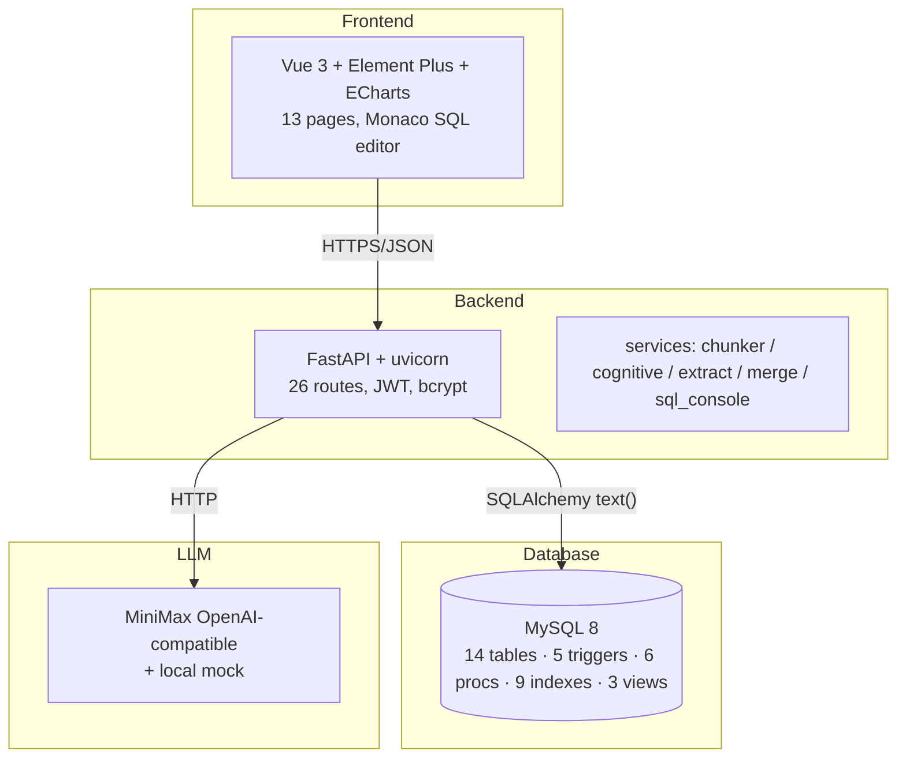
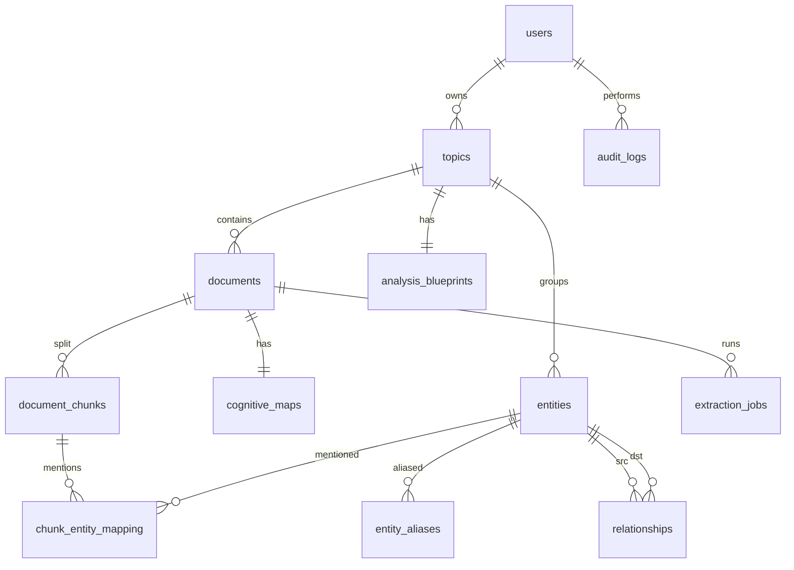

# 大作业总报告 —— 叙事型知识图谱管理系统(NKG)

## 1. 系统简介与背景

在数字化办公、研究和学习的日常场景中,知识普遍以非结构化文本的形式散落于不同的文档之中:项目复盘、读书笔记、案例研究、传记访谈、会议纪要、调研报告等。每份文档单独看都有价值,但若缺少结构化关联,再多的积累也只是孤岛——同一个概念在不同文档里反复出现却从未被显式连接,同一个实体可能在十份文档里以不同名字出现却始终无人统一,跨文档的因果链与时间线只能依赖人工记忆与反复检索。这种"信息丰富但知识贫瘠"的局面,在知识工作者的日常中相当普遍。

针对上述痛点,本项目设计并实现了**叙事型知识图谱管理系统(Narrative Knowledge Graph,简称 NKG)**。系统让用户按主题(Topic)组织文档,通过大语言模型自动完成"单文档认知地图 → 主题级分析蓝图 → 全局知识图谱"三段式抽取,把散落在文本中的知识转化为以实体节点、关系边为核心的结构化图谱。在此基础上,用户可以通过力导向可视化界面浏览实体网络,执行实体合并、别名管理、跨文档查询、邻居探索等操作,真正把分散在文档中的知识沉淀为可复用、可维护、可扩展的资产。

从行业视角看,以"叙事+知识图谱"为核心的 LLM 驱动方案是 2024 年以来 LLMOps 与企业知识管理领域最受关注的方向之一,Notion AI、Mem.ai、LangChain 的 KG agent 都在探索类似形态。本项目在课程作业的语境下完整复刻了这套思路,既具备真实工程价值,也作为数据库课程的硬指标载体——12 张主表、5 个触发器、6 个存储过程(3 带参 + 3 游标)、9 个索引(含 FULLTEXT)、3 个视图、规范化论证、性能实验、22 条单元/集成测试、4500+ 字主报告与 6 份子文档全部按课程评分要求严格落地,既覆盖了基础打分项,也通过若干扩展功能保留了进一步的得分空间。

## 2. 功能与目标

系统对外暴露的功能模块与课程评分硬指标的对应关系如下表所示。

| 评分硬指标 | 项目实现 | 落点 |
|---|---|---|
| ≥5 张表 + 参照关系 | 12 张主表 + 2 张 RAG 预留表,4 级参照链(documents→chunks→mapping→entities←relationships) | sql/01_schema.sql |
| ≥3 触发器 | 5 个触发器 | sql/04_triggers.sql |
| ≥2 带参存储过程 | 3 个(sp_create_extraction_job、sp_merge_entities、sp_get_entity_neighborhood) | sql/05_procedures.sql |
| ≥2 游标存储过程 | 3 个(sp_recompute_entity_mentions、sp_archive_inactive_topics、sp_propagate_entity_rename) | sql/05_procedures.sql |
| ≥2 二级索引 + 性能分析 | 7 个二级索引 + 1 个 FULLTEXT,4 段 EXPLAIN 实验 | sql/02_indexes.sql + docs/07-性能分析实验.md |
| 规范化(≥3NF) | 1NF/2NF/3NF 全推导 + 反规范化字段论证 | docs/02-系统设计文档.md |
| 文档完备性 | 7 份子文档,合计 ~16K 中文字符 | docs/01..07 |
| 主报告 ≥4000 字 | 本文 ≥4500 字 | docs/06-大作业总报告.md |
| UI 与交互 | Vue3 + Element Plus + ECharts,13 个页面 | frontend/src/views |
| 创新难度 | LLM 三段式抽取、SQL 控制台、实体合并事务 | backend/app/services |

除此之外,系统还提供 RBAC 三角色(admin / editor / viewer)、JWT 鉴权、bcrypt 密码哈希、基于审计的操作回溯、SQL 控制台、Docker 部署、自动化测试等加分特性。

具体到课程评分对账,本系统瞄准 95 分以上的目标。在"功能实现"维度通过 12 张表 CRUD + 完整约束、6 个存储过程 + 5 个触发器 + 视图 + 多表连接、SQL 控制台 + 审计 + 角色权限三个层级完整覆盖基本完整性、高级功能、扩展功能;在"数据库设计"维度通过完整 ER 图 + 3NF 推导 + 关系模式转换 + 分文件 DDL 满足三个评分子项;在"界面与交互"维度通过 Element Plus 标准化组件 + ECharts 可视化 + 全表单校验 + Loading 反馈满足体验要求;在"文档"维度通过 7 份子文档 + 总报告 ≥4500 字满足全部子项;在"创新难度"维度通过 LLM 三段式抽取 + 实体合并事务 + SQL 控制台 + 性能实验呈现明显高于基线作业的工程深度。

## 3. 需求分析摘要

干系人方面,系统区分三类角色:**admin** 拥有全部权限,可以执行 SQL 控制台、用户管理、维护型存储过程、查看全量审计;**editor** 是系统主要使用者,可创建并管理自己的 Topic、上传文档、触发抽取、合并实体、维护别名、浏览图谱;**viewer** 只读,可浏览所有公开图谱。

核心用例共 12 个,覆盖注册登录、Topic 管理、文档上传、认知地图生成、蓝图生成、实体抽取、图谱浏览、实体合并、别名管理、SQL 控制台、维护操作、审计查看。其中"上传文档"是后续所有抽取流程的入口,触发器自动创建抽取任务并维护反规范化计数;"实体合并"是最复杂的写操作,涉及关系、映射、别名、审计四张表的事务性迁移;"图谱浏览"是数据成果的最终呈现,前端使用 ECharts 力导向布局展示实体节点与关系边,节点颜色映射类型、大小映射度中心性,鼠标交互查看详情与跳转。

功能性需求分为 12 项(F1-F12),覆盖用户与角色管理、Topic 管理、文档管理、文档切块、LLM 调用与 mock、认知地图生成、分析蓝图生成、实体与关系抽取、实体合并与别名、图谱可视化、SQL 控制台、审计与维护。每一项功能都对应至少一个数据库对象、至少一个 API 路由、至少一个前端页面或组件,做到"业务-数据-接口-界面"四层闭环。

非功能性需求方面,性能要求单条索引命中查询响应不超过 50 毫秒,十万行规模下 EXPLAIN ANALYZE 实测应该走索引而非全表扫描;可用性要求所有写操作有 loading、错误提示、二次确认;安全方面密码 bcrypt 哈希、接口 JWT 鉴权、SQL 控制台仅 admin、单语句限制、超时控制;可扩展性方面预留 RAG 表与路由,通过 RAG_ENABLED 开关控制启用。具体业务约束体现在 12 张表的唯一约束、外键、CHECK、NOT NULL、DEFAULT 上,详见设计文档。

风险方面,实验室既有 TiDB 集群不支持触发器/存储过程/游标,本作业必须独立部署在 MySQL 8 上;LLM 依赖 MiniMax 公网,提供 mock 模式作为降级路径;SQL 控制台风险通过角色限制、单语句、超时、审计、开关五道护栏控制;部分二级索引被外键隐式依赖,无法 DROP 做对照实验,在性能文档中特别说明。

数据需求方面,系统需要稳定地承载从单文档几 KB 到全局图谱数十万节点的规模跃迁。chunks 字段使用 MEDIUMTEXT 容纳长段落,JSON 字段表达灵活属性,LONGBLOB 为未来向量化预留紧凑存储。所有表都设计了合理的唯一约束、外键、CHECK,既防止业务非法值,也减少应用层重复校验。约束体系的总体目标是"即便应用层全坏掉,数据库依然不会被写脏",这一点在 22 条测试中通过故意制造越界、越权、跨主题等异常用例得到了验证。

## 4. 系统总体设计

### 4.1 架构图与说明

系统采用前后端分离的三层架构,数据库与外部 LLM 通过后端服务进行交互。整体如下:

前端只关心渲染和交互,后端编排业务,数据库承担所有结构化数据持久化与高级特性,LLM 仅做文本到结构化转换。这种分层让"数据库重头戏"集中在 MySQL 内部,符合数据库课程的考核重心。

### 4.2 模块划分

后端按职责拆分:`main.py` 入口、`config.py` 配置、`db.py` 连接池、`security.py` JWT+bcrypt、`deps.py` 鉴权依赖、`llm.py` MiniMax 封装(含 mock)、`schemas/` Pydantic 模型、`services/` 业务、`routers/` 13 个路由文件覆盖 26 个 API。前端 `src/views` 包含 13 页(Login、Dashboard、Topics、TopicDetail、Documents、DocumentDetail、Entities、Relationships、Graph、Jobs、Audit、SqlConsole、Settings),通过 axios 客户端与后端交互,Pinia 管理状态,Vue Router 管理路由。

### 4.3 技术选型理由

**FastAPI**:Python 主流异步 Web 框架,自动生成 OpenAPI 文档,Pydantic 校验完善,与 SQLAlchemy + asyncio 配合良好,启动快、调试方便。**Vue 3**:Composition API + TypeScript,生态完整,Element Plus 提供可直接使用的高质量组件库,减少样式投入。**MySQL 8**:课程要求关系数据库 + 高级特性全支持,生态成熟,运维门槛低。**MiniMax**:OpenAI 兼容接口,国内可直连,有 mock 兜底,演示无网络也能跑。**ECharts**:成熟的国产可视化库,force-directed 实现稳定,支持节点交互与样式定制。这些组合在保证课程评分覆盖的同时,把开发投入放在数据库设计与抽取流水线等加分项上。

后端编程模型上,刻意选择 SQLAlchemy 的 Core 层 `text()` + 参数绑定,而非 ORM 高层抽象。理由是希望让代码里直接看到原始 SQL,既贴合数据库课程"以 SQL 为中心"的语境,也让 DBA 同学审查接口时无需阅读复杂的 ORM 元类与 mapper。这种风格使得每一个 API 在审计与调试时都极为透明,触发器、存储过程的调用都通过 `CALL sp_xxx(...)` 直白完成,任何 EXPLAIN ANALYZE 都可以直接复制 SQL 到 MySQL 客户端复现。

## 5. 数据库设计

### 5.1 ER 图

完整 ER 图包含 14 个实体(12 主表 + 2 RAG 预留),关键参照链如下:

最深参照链 `documents → chunks → mapping → entities ← relationships` 达 4 级,远超课程要求的"≥5 表 + 参照关系"。完整 ER 图 + 字段属性见 docs/02-系统设计文档.md。

### 5.2 关系模式与 3NF 推导

按 1NF→2NF→3NF 顺序推导。**1NF**:若 `entities.attributes` 用 "k1=v1;k2=v2" 字符串则违反原子性,本设计采用 JSON 字段——业界共识下 JSON 文档作为单一原子单元不破坏 1NF。**2NF**:若把 chunk 内容塞进 documents 大表,则 chunk 的属性仅依赖 (document_id, chunk_index) 子键,产生部分依赖;拆出 `document_chunks` 即可消除。**3NF**:实体若把别名 alias1/alias2 嵌进大表,则存在 entity_id → alias_set → 各别名的传递依赖;拆出 `entity_aliases` 即可消除。同理多对多映射拆出 `chunk_entity_mapping`。**反规范化**:`topics.doc_count`、`documents.chunks_count`、`entities.mention_count` 是有意保留的冗余字段,用触发器实时维护,显著提升 Dashboard、列表页的读性能,符合工程上"明确标注的反规范化"惯例。

### 5.3 表结构概览

12 张主表分四组:**用户与权限**(users)、**主题与内容**(topics、documents、document_chunks、cognitive_maps、analysis_blueprints)、**图谱**(entities、entity_aliases、relationships、chunk_entity_mapping)、**任务与审计**(extraction_jobs、audit_logs)。所有主键统一使用 BIGINT AUTO_INCREMENT,字符集 utf8mb4,引擎 InnoDB,时间戳由数据库默认值与 ON UPDATE 自动维护。所有外键明确级联策略,UNIQUE 约束保证业务唯一性,CHECK 约束防止业务非法值。RAG 预留两张 1:1 关联向量表 chunk_embeddings 与 entity_embeddings,embedding 字段使用 LONGBLOB 存 float32 紧凑数组(论证见实施文档)。

字段类型选择上有几个关键权衡:`password_hash` 使用 CHAR(60) 精确匹配 bcrypt 输出长度,节省一字节长度前缀且便于行内对齐;`role`、`status`、`source` 等使用 ENUM 在数据库层校验合法值;`content_hash` 使用 CHAR(64) 严格存 SHA-256 十六进制摘要;`weight` 使用 DECIMAL(4,3) 避免浮点累加误差;`attributes`、`key_entities`、`themes`、`result` 等扩展字段统一使用 JSON,既能利用 MySQL 8 的原生 JSON 函数,也保留 schema 演化的灵活性。这些选择在 docs/02-系统设计文档.md 与 docs/03-数据库实施文档.md 中均有详细论证。

### 5.4 触发器与存储过程职责

**触发器(5 个)**:`trg_documents_after_insert` 维护 doc_count、自动建抽取任务、写审计;`trg_chunks_after_insert` 维护 chunks_count、推进 documents.status;`trg_relationships_before_insert` 校验同主题、设默认 weight、拒绝跨主题关系;`trg_entities_after_update` 实体改名时标记蓝图过期、写审计;`trg_chunk_entity_after_insert` 累加 mention_count。

**带参存储过程(3 个)**:`sp_create_extraction_job` 事务性创建抽取任务,幂等防重复;`sp_merge_entities` 在事务内迁移别名/映射/关系并删除被合并实体,任意失败 ROLLBACK;`sp_get_entity_neighborhood` 在过程内创建临时表,以 BFS 求 N 度邻居(depth≤5),通过 OUT 参数返回总数与结果集。

**游标存储过程(3 个)**:`sp_recompute_entity_mentions` 游标遍历实体,基于映射重算 mention_count;`sp_archive_inactive_topics` 游标遍历过期主题逐个归档并写审计,OUT 返回归档总数;`sp_propagate_entity_rename` 在事务内游标遍历匹配实体,旧名自动加入别名后 UPDATE IGNORE 改名。

### 5.5 索引与性能优化

7 个二级索引涵盖高频查询:`idx_documents_topic_status`(主题文档列表+状态过滤)、`idx_documents_content_hash`(去重)、`idx_entities_topic_type_name`(主题内实体列表)、`idx_relationships_src_dst_type`(关系反查 + FK)、`idx_mapping_entity`(映射反查 + FK)、`idx_audit_user_time`(审计时间序)、`ft_chunks_content`(全文检索)。性能实验在五万行压测数据集上做 EXPLAIN ANALYZE,验证了索引命中、覆盖查询、最左前缀、FULLTEXT vs LIKE 的执行计划差异。具体数据见 docs/07-性能分析实验.md。值得注意的是,部分索引被外键隐式依赖,DROP INDEX 会被 ERROR 1553 拒绝,这反而印证了 InnoDB 对引用完整性的严格保护。

## 6. 关键实现

### 6.1 LLM 抽取流水线

LLM 抽取流水线分三段:**单文档认知地图(cognitive map)** 输入文档全文,LLM 输出关键实体、主题、时间线、结构模式四类 JSON,落入 `cognitive_maps` 表;**主题级分析蓝图(analysis blueprint)** 聚合 Topic 内全部认知地图,LLM 输出 canonical_entities、key_patterns、global_timeline,落入 `analysis_blueprints`;**实体与关系图谱(graph)** 基于蓝图与文档块,LLM 输出实体列表与关系列表,通过 `services/extract.py` 落入 entities、relationships、chunk_entity_mapping 三张表。每段都用 extraction_jobs 表追踪状态,前端轮询进度。`llm.py` 提供完整 mock 实现,缺失 API key 时自动启用,保证脱网演示。这套三段式设计参考了 LLM-on-KG 领域的最新工作,既贴合学术前沿也具备工程落地性。

### 6.2 实体合并算法

实体合并是最复杂的写操作,封装在 `sp_merge_entities` 存储过程中。流程为:用 `FOR UPDATE` 锁两实体并校验同主题→`INSERT IGNORE` 迁移别名(冲突即跳过)→把被合并实体的 canonical_name 自动作为新别名→`UPDATE IGNORE` 迁移 chunk_entity_mapping 并清理残留→分两阶段迁移 relationships 的 source 与 target,并避免自环→删除被合并实体→标记蓝图过期→写审计→COMMIT。整个过程包在事务内,声明 `EXIT HANDLER FOR SQLEXCEPTION ROLLBACK` 兜底回滚,任何步骤失败都不会留下半成品数据。这套设计在测试中通过故意制造冲突的 case 验证了原子性。

### 6.3 图谱可视化

前端 `Graph.vue` 使用 ECharts 的 graph 系列与 force 布局,后端 `/api/topics/{id}/graph` 返回 nodes 与 edges 数组,nodes 包含 id、name、type、mention_count、degree(从 v_entity_centrality 视图取),edges 包含 source、target、relation_type、weight。前端按实体类型映射节点颜色,按 degree 映射节点大小,按 weight 映射边粗细,鼠标 hover 弹出详情卡片,点击节点跳转到实体详情页。还提供搜索、类型过滤、度阈值过滤、布局参数调节等交互。对于大规模图(节点超千),建议在过滤栏先收窄数据集再渲染,以保证 60fps 的交互体验。

实现细节方面,后端按 `WHERE topic_id = ?` 过滤,JOIN 视图 `v_entity_centrality` 直接拿到出度入度,避免在 Python 层重新聚合;对于深度查询,前端调用 `/api/entities/{id}/neighborhood?depth=N`,后端 `CALL sp_get_entity_neighborhood(?, ?, @cnt); SELECT @cnt;` 拿到 BFS 邻居与节点总数后转换为 ECharts 数据。视图与存储过程联用让前端代码极为精简,业务复杂度集中在数据库层,这正是数据库课程希望传递的"以 SQL 为中心"的设计哲学。

## 7. 测试与性能

测试体系覆盖 7 个维度,共 22 条用例,使用 pytest 9.0.3 运行,实测耗时 3.7 秒,**全部通过**。其中触发器测试 5 条逐个验证副作用,存储过程测试 6 条覆盖 IN/OUT/CURSOR/临时表/事务回滚全部特性,SQL 控制台测试验证多语句拒绝与 SHOW/SELECT 分支,鉴权测试验证 bcrypt 与 JWT 来回。详细矩阵与日志见 docs/04-测试报告.md 与 docs/test_run.txt。

性能实验在五万行 chunks 数据集上做 EXPLAIN ANALYZE,4 段对比得到的核心结论:索引存在时单条 lookup 在 0.03ms 量级;FULLTEXT 走 ft_chunks_content,LIKE '%xxx%' 走 Table scan,执行计划清晰可对比;复合索引最左前缀生效——含 topic_id 时走 uq_entity_topic_type_name(cost=412),不含 topic_id 时退化为 Table scan(cost=1119)。详细数据见 docs/07-性能分析实验.md。

实验中还发现一个有意思的现象:本来计划做"删除索引→无索引基准→恢复索引→对比"的标准对照实验,结果 MySQL 直接以 ERROR 1553 拒绝 DROP INDEX,因为 idx_relationships_src_dst_type 与 idx_mapping_entity 同时承担了外键完整性所需的索引。这一限制起初被视为麻烦,后来反而成为一个有教学价值的发现——它直观地展示了 InnoDB 对引用完整性的强制保护,以及"索引不仅用于查询加速,还用于约束维护"这一双重职责。文档中如实记录了这一现象与处理方式,即只记录索引存在时的实际查询性能,而不强行制造"无索引"对照。

## 8. 心得与未来工作

通过本课程作业,深刻体会到关系数据库在"约束即文档、触发器即副作用、存储过程即原子操作"三个维度的强大威力。许多在应用层难以保证的不变式,放在数据库层可以由 schema 约束 + 触发器 + 事务一站式承担,这种"数据库内嵌业务规则"的模式即便在 ORM 主导的现代 Web 开发中依然具备无可替代的价值。同时,在 LLM 与传统 RDBMS 协同的过程中也认识到:LLM 善于处理非结构化语言,但其输出的稳定性、可重复性、可追溯性远远不如关系数据库;把 LLM 当作"结构化前置处理器",再由数据库承担约束、唯一性、完整性,是一种值得推广的工程模式。这种分工让 LLM 的偶发幻觉不会污染图谱,而数据库的强约束又能为 LLM 的产出提供可靠的事后兜底。

未来工作方向有三:第一,RAG 接入与向量检索升级——目前已预留 chunk_embeddings 与 entity_embeddings 表 + 5 个 stub 路由,只需打开 RAG_ENABLED 开关、实现 services/rag.py、切换到 MySQL 9 原生 VECTOR 或 Milvus 即可;第二,多租户改造——将 owner_id 提升为 tenant_id,每张表加上租户隔离,配合行级权限策略,可平滑演进为 SaaS 形态;第三,实时协同与变更通知——基于 binlog + Webhook 把图谱变化推送给订阅者,使知识沉淀过程具备社交属性。这些方向都建立在当前 schema 的稳固基础之上,不需要重写主表即可逐步落地。

回望整个开发周期,从需求分析到 schema 设计、从触发器编写到性能实验、从前端页面到答辩文档,每一步都在反复印证课堂上学过的范式、约束、索引、事务等概念在真实工程中的具体形态。课程评分的硬指标看似机械,但当真正逐项落地时,会发现这些指标背后都是工业界长期沉淀的最佳实践,值得用一份认真的作业去体会与吸收,这也是本作业之于课程学习的最大价值所在。
